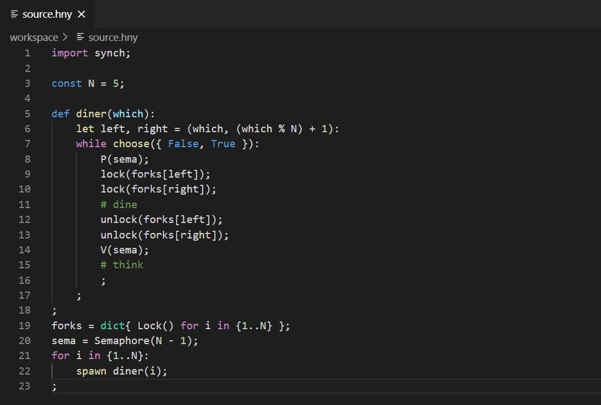
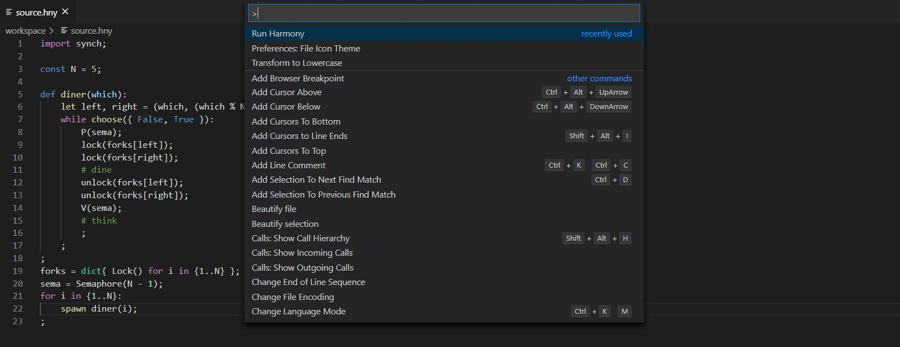
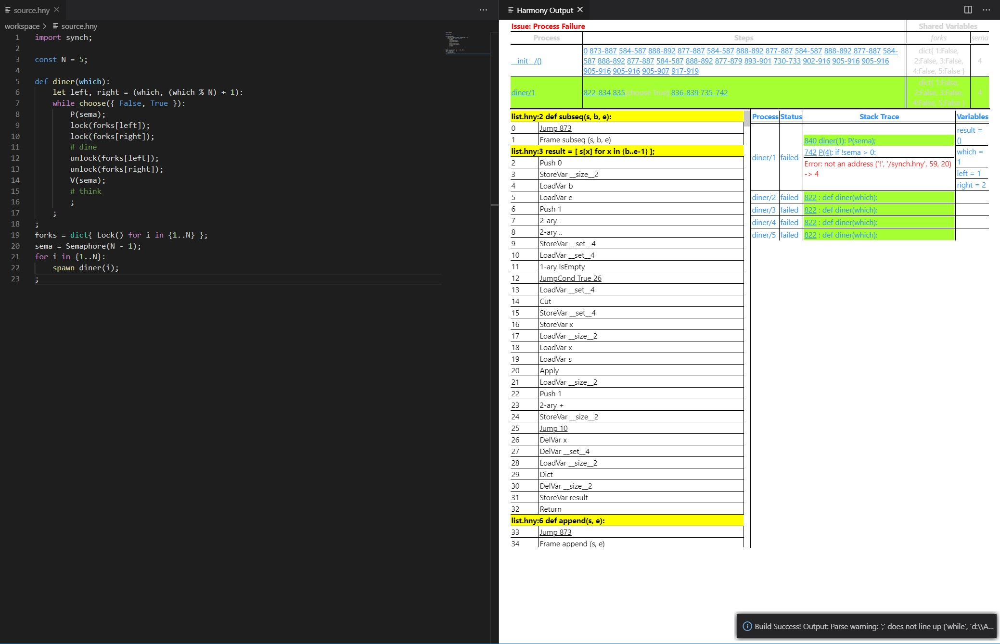

# HarmonyLang

HarmonyLang provides general VS compatibility with RvR's [Harmony](http://www.cs.cornell.edu/home/rvr/harmony/), a Python-like programming language for testing and experimenting with concurrent programs designed for Cornell University's CS 4410/4411 course.

## Features

Provides advanced syntax highlighting for all flow control, method definition, and literals based on the [default VSCode extension for Python](https://github.com/microsoft/vscode).

Supported syntax:
 - Control statement keywords (`for`, `while`, `if`, `else`)
 - Literals (`True`, `None`, and numerics)
 - Assignment operators (`and=`, `//=`, and `mod=`)
 - Binary operators (`and`, `**`, and `>=`)
 - Comments (`#line` and `(* block *)`)

Run your Harmony files in VS Code. Press `Ctrl+Shift+P` and search `Run Harmony` to compile and run the current `.hny` file.

See your Harmony Output results, right in VS Code!

> Generated `harmony.html` files are saved to the extension's internal compiler.

## Upcoming Features

 - Auto-formatter
   - Format on save
   - Format via `Shift-Alt-F`
 - Intellicode Support

## Developers

 - Kevin Sun     `@kevinsun-dev`

 - Anthony Yang     `@ayang4114`

## Release Notes

### 0.0.5 - Unreleased

- Add `End All Harmony Processes` command, with keybinding `Ctrl+Shift+Q`.
- More helpful messages.

### 0.0.4

- Built the Harmony compiler directly into the extension. Removed requirement to download the compiler separately.
- Show the Harmony Output window only if the build succeeds. The Harmony Output window is closed if the build fails.
- Bug fixes.

### 0.0.3

- Added Unix compatibility for `Run Harmony File`.

- Reworked build success/failure reporting.

### 0.0.2

- Added HarmonyLang extension icon and Harmony file icons. VS Code currently does not support icon fallback, so the latter is currently disabled.

- Added `Run Harmony File` command.

- Added Harmony Output window.

### 0.0.1

- Added Harmony syntax highlighting based on the [default VSCode extension for Python](https://github.com/microsoft/vscode)
