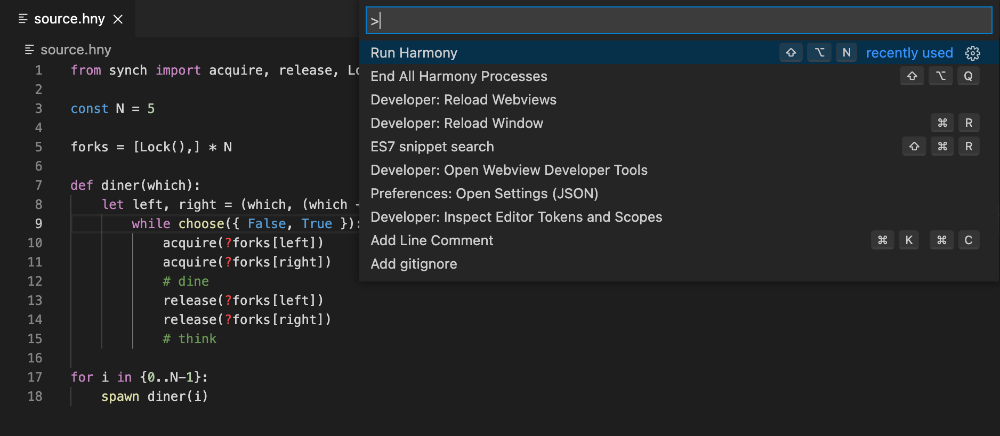
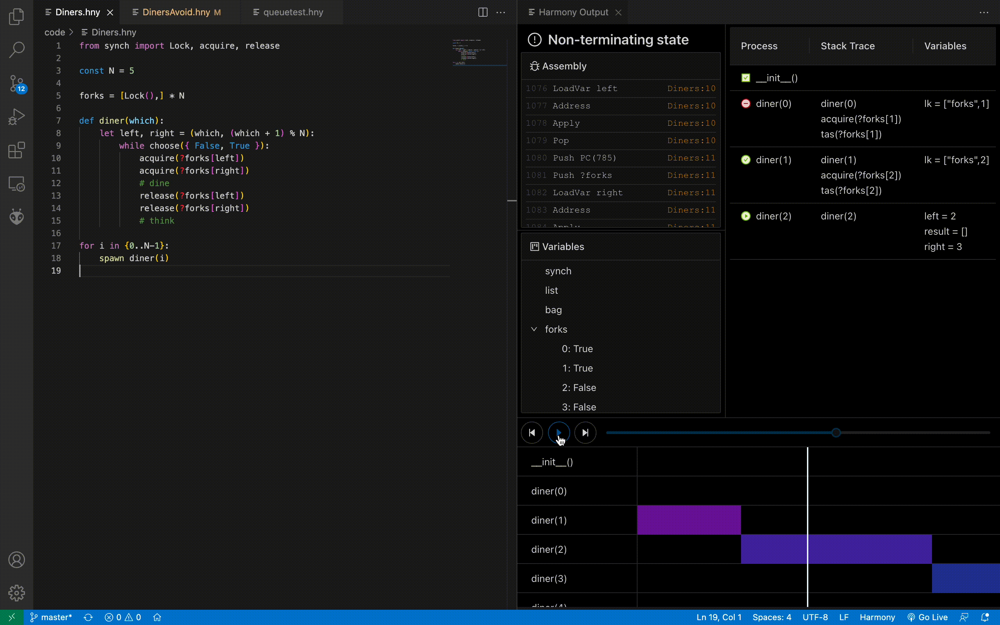
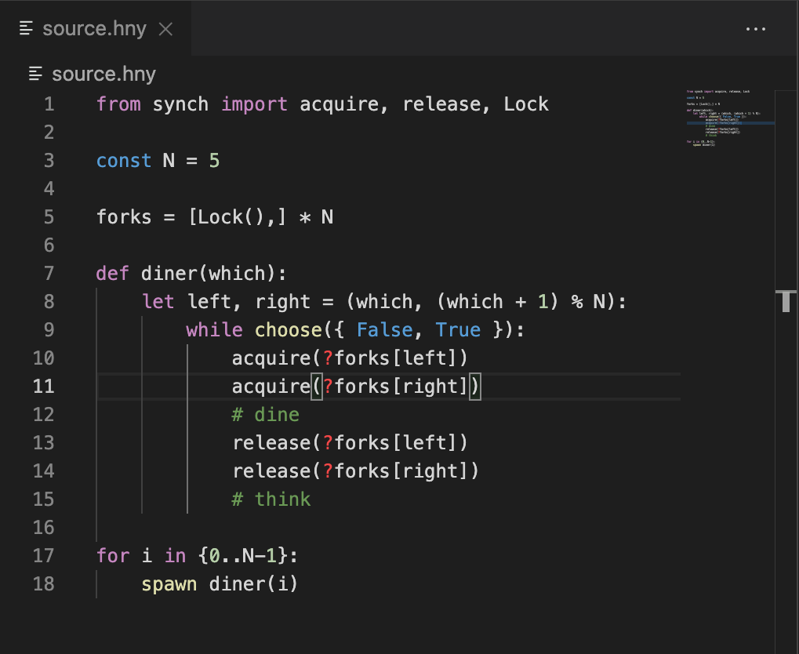

# HarmonyLang

HarmonyLang provides a powerful development environment for RvR's [Harmony](http://harmony.cs.cornell.edu), a Python-like programming language for testing and experimenting with concurrent and distributed systems.

## Requirements

- `Python 3.6` or higher
- `C` compiler like `gcc`, `cc`, or `clang`

## Configuration Values

The following values can be configured in a local or global `settings.json` file for VSCode.

- `harmonylang.pythonPath`: Path to the Python interpreter

## Commands

The following commands are run using the Command Palette:

> You can now also right click `.hny` files in the Editor or Explorer to `Run Harmony` with or without flags.

- `Run Harmony`

> Alternatively: use the keybinding Alt + Shift + N keys

Compiles the currently opened file if it is a Harmony file, i.e. has the extension `.hny`. If compiled, it runs the model-checker.

- `Run Harmony with Flags`

Same as `Run Harmony`, except an input prompt first appears to ask for any flags to passed into the Harmony compiler. Only the flags `-c` (for constants) and `-m` (for modules) are supported.

- `Install Harmony`

Installs the latest version of Harmony into the extension's directory. This requires `Python 3.6` (or higher) and a `C` compiler. Sets the directory where Harmony is installed as the extension's `libraryPath` configuration value.

- `End All Harmony Processes`

Ends all processes created and managed by this extension. This includes running a Harmony program that does not terminate in a timely manner.

## Features

### Run Model Checking

Run your Harmony files in VS Code. Press `Alt+Shift+N` to compile and run the current `.hny` file. Alternatively, press `Ctrl+Shift+P` and search `Run Harmony` to find the same command. Kill all running Harmony processes with `Alt+Shift+Q`.

### Advanced Process Visualizer

Trace the execution of a Harmony program from initialization to failure, examining threads, variables, and stack traces every step along the way.

### Syntax & Error Highlighting

Complete language support with realtime error messages.

## Upcoming Features

- Auto-formatter
  - Format on save
  - Format via `Alt+Shift+F`

## Developers

- Kevin Sun`@kevinsun-dev`

- Anthony Yang`@anthonyyangdev`

## Additional Documentation

You can find more information about the HarmonyLang extension project in [this document](https://docs.google.com/document/d/16pO-tNLfNebIAuqb_vy_z0dJyIFX_Nb-xYDXRfMqOfE/edit?usp=sharing). Furthermore, you can find the Harmony Python compiler, as well as additional documentation regarding the Harmony language, at this [link](http://harmony.cs.cornell.edu).

## Release Notes

### 2.1.0

- Added syntax highlighting for `save` expressions
- Added right-click context commands for `Run Harmony`
- Bug fixes

### 2.0.0

- Updated installation method to use `pip`
- Added compatibility for graph visualization
- Updated syntax highlighter
- Removed build commands _(unneccesary for recent versions of Harmony)_
- Bug fixes

### 1.1.0

- Added code autocompletion and error highlighting
- Migrates to the new Melody Analysis Suite, with an improved UI
  - Implements the previous standalone analyzer as a fallback
- Bug fixes

### 1.0.0

- Focuses on installing/supporting a local version of Harmony.
- Update to support the latest version of Harmony (`1.2`).
- Removes the `(Server) Run Harmony` command. For this command, please see and use [this extension](https://marketplace.visualstudio.com/items?itemName=kevinsun-dev-cornell.harmonylang-lite);

### 0.2.3

- Add a `(Server) Run Harmony` command, which will try to run your Harmony files on a remote server that hosts the Harmony compiler. This may help those whose systems are not compatible with the local installation of Harmony
- Update the built-in Harmony compiler
- Bug fixes

### 0.2.0

- New `(C)Harmony` compiler, which uses `C/Python` to optimize model-checking.
  - This will require `Python3` and a `C` compiler to be installed.
- Fix bugs in the Interactive Process Visualizer.

### 0.1.3

- Updated HarmonyLang to use Harmony 0.9 LTS compiler
- Bug fixes.

### 0.1.0

- Massive UI overhaul with compiler output rewrite.
  - Interactive Process Visualizer
  - Crash Timeline Playback
- Removed previous UI
- Removed Notification Output System
- Bug fixes

### 0.0.6

- Include `Add 'harmony' to PATH` command, which add and setup the harmony CLI compiler on the device. (Unix only)
- Include `Remove 'harmony' CLI` command, which removes the added harmony CLI compiler with the above command from the device. (Unix only)
- Lowered required VS Code version to 1.42+.
- Bug fixes.

### 0.0.5

- Add `End All Harmony Processes` command, with keybinding `Alt+Shift+Q`. For Mac users, substitute `Alt` for `Option`.
- More helpful messages.

### 0.0.4

- Built the Harmony compiler directly into the extension. Removed requirement to download the compiler separately.
- Show the Harmony Output window only if the build succeeds. The Harmony Output window is closed if the build fails.
- Bug fixes.

### 0.0.3

- Added Unix compatibility for `Run Harmony File`.

- Reworked build success/failure reporting.

### 0.0.2

- Added HarmonyLang extension icon and Harmony file icons. VS Code currently does not support icon fallback, so the latter is currently disabled.

- Added `Run Harmony File` command.

- Added Harmony Output window.

### 0.0.1

- Added Harmony syntax highlighting based on the [default VSCode extension for Python](https://github.com/microsoft/vscode)
