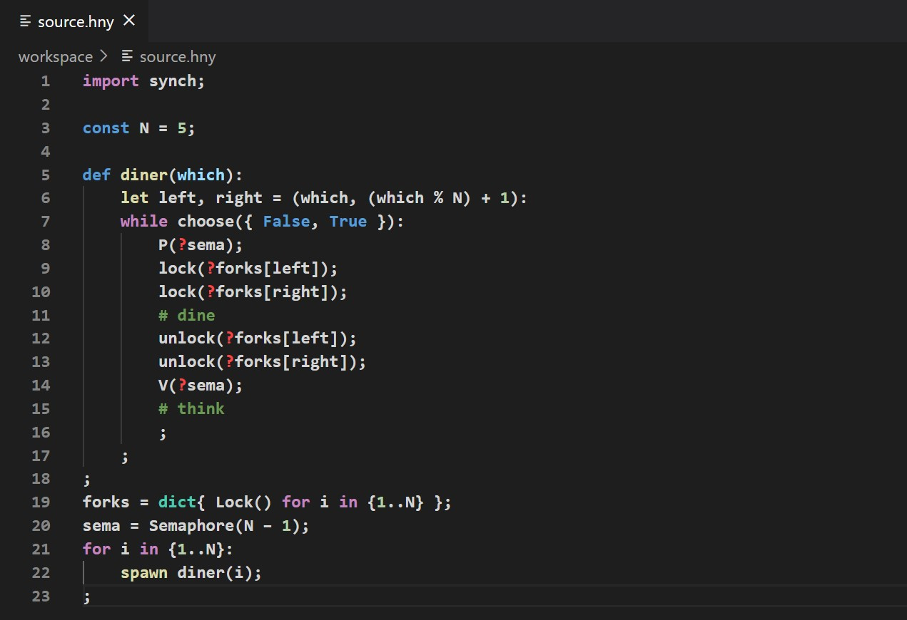

# HarmonyLang

HarmonyLang provides general VS compatibility with RvR's [Harmony](http://www.cs.cornell.edu/home/rvr/harmony/), a Python-like programming language for testing and experimenting with concurrent programs designed for Cornell University's CS 4410/4411 course.

## Features

Provides advanced syntax highlighting for all flow control, method definition, and literals based on the [default VSCode extension for Python](https://github.com/microsoft/vscode).

Supported syntax:
 - Control statement keywords (`for`, `while`, `if`, `else`)
 - Literals (`True`, `None`, and numerics)
 - Assignment operators (`and=`, `//=`, and `mod=`)
 - Binary operators (`and`, `**`, and `>=`)
 - Comments (`#line` and `(* block *)`)

## Upcoming Features

 - Auto-formatter
   - Format on save
   - Format via `Shift-Alt-F`
 - Harmony Icon
 - Intellicode Support

## Release Notes

### 0.0.2

Added HarmonyLang extension icon and Harmony file icons. VS Code currently does not support icon fallback, so the latter is currently disabled.

### 0.0.1

Added Harmony syntax highlighting based on the [default VSCode extension for Python](https://github.com/microsoft/vscode)
